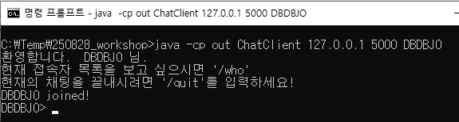
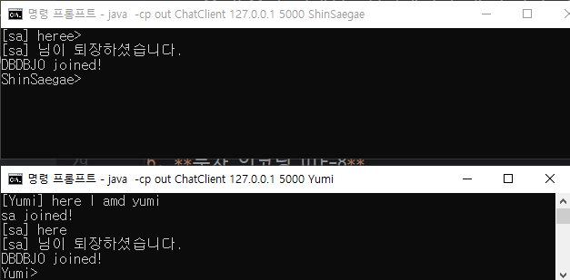
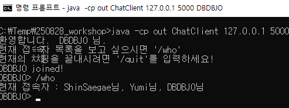
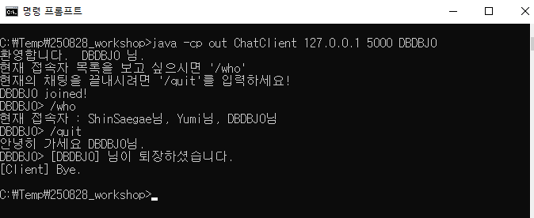
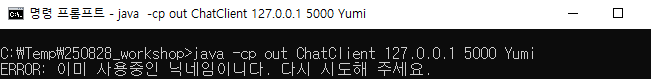
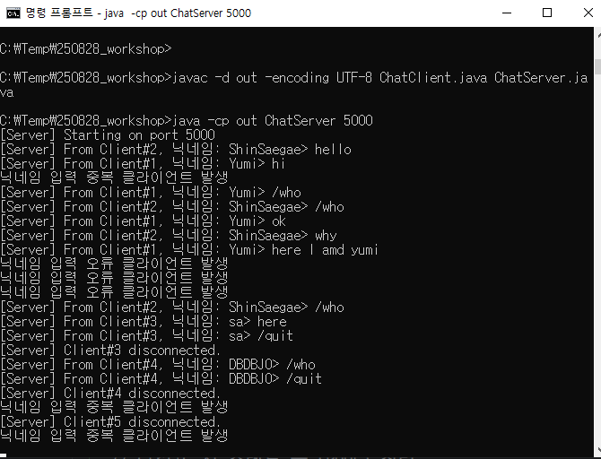
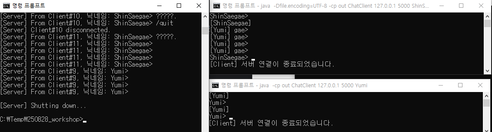

## 멀티 쓰레드 다중 클라이언트 소켓 TCP 통신 기반 채팅 프로그램


### 1. 구현 목표 (Goals)

- **TCP 소켓**을 이용해 서버 1대 · 다수 클라이언트 구조 구현
- **닉네임**을 사용한 접속한 사용자 간 대화, **사용자의 입장/퇴장 안내** 메시지
- 서버/클라이언트의 **정상 종료** 처리
- 기본 **예외 처리**(연결 끊김, 잘못된 입력 처리)
- 서버 콘솔에서 접속 사용자 및 대화 확인(~~사용자 대화 감청~~)


### 2. 구현 필수 기능 (Must)

1. **서버 시작/종료**
    - 지정 포트로 listen (기본 5000)
    - Ctrl+C, 예외 발생 시 소켓·스레드 정리 후 종료
2. **멀티 클라이언트 처리**
    - 각 클라이언트를 스레드(또는 스레드풀)로 처리
    - 브로드캐스트: 한 사용자의 메시지를 모든 사용자에게 전달
3. **닉네임 등록**
    - 접속 후 첫 메시지: `<NICK> 환영메시지`
    - 공백/중복 닉네임 거절(에러 안내 후 연결 종료 가능)
4. **입장/퇴장 알림**
    - 예: `Alice joined` / `Bob left`
5. **기본 명령**
    - `/quit` : 클라이언트 종료
    - `/who` : 현재 접속자 목록 출력
6. **문자 인코딩 UTF-8**
    - 한글 입출력 정상 동작

### UserCase
- 학생 A로서, 프로그램을 실행하여 **닉네임**을 정하고, 다른 사용자와 **대화**하고 싶다.
  - `java -cp out ChatClient 127.0.0.1 5000 DBDBJO`
  
  
   

- 학생 B로서, `/who`로 현재 **접속자 목록**을 보고 싶다.
  

- 학생 C로서, `/quit`으로 **깨끗하게 종료**하고 싶다.
  

- 같은 닉네임인 경우 접속 제한
  

- 서버 관리자는 모든 접속자의 입/퇴장과 대화를 확인할 수 있다.

  

- 서버 관리자의 강제 종료 시 서버와 클라이언트 모두 종료된다.

  
### 실행 가이드
```windows
# 컴파일
javac -d out ChatServer.java ChatClient.java

# 서버 실행 (기본 포트 5000)
java -cp out ChatServer 5000

# 클라이언트 실행
java -cp out ChatClient 127.0.0.1 5000 Yumi
java -cp out ChatClient 127.0.0.1 5000 ShinSaegae
```

### 문제점
- 윈도우 콘솔에서 한글 표시 제한
> intellij에서 실행 시 한글 채팅이 되었으나 윈도우 콘솔에서는 한글 표시가 안된다.
> 아래와 같이 콘솔창에 직접 인코딩을 시도를 했지만 안되었다. 추가 테스트가 필요하다.
> `java -Dfile.encoding=UTF-8 -cp out ChatClient <server_ip> <port> <nickname>`
> `chcp 65001`

### 주요 코드 구현 내용

#### ChatServer.java
```java
public class ChatServer {

  // 서버의 포트 번호 정적 변수
  private static int PORT;
  // 서버가 관리할 스레드 풀
  private static final ExecutorService POOL = Executors.newCachedThreadPool();
  private static final AtomicInteger CLIENT_SEQ = new AtomicInteger(1);
  // 사용자 닉네임 관리 정적 변수 지정
  private static final Set<String> userNicknames = new HashSet<>();

  // 모든 클라이언트의 출력 스트림을 관리하는 동기화된 집합
  private static final Set<PrintWriter> clientWriters = Collections.synchronizedSet(
      new HashSet<>());

```

서버에서 모든 클라이언트에게 메시지 브로드캐스팅
```java
  // 모든 클라이언트에게 메시지를 브로드캐스팅하는 메서드
  private static void broadcast(String message) {
    // 한 스레드가 브로드캐스트 하는 동안 전체 clientWriters가 나가거나(remove), 추가되어(add) 반복문에 영향을 미치지 못하게 해야 한다.
    synchronized (clientWriters) {
      for (PrintWriter writer : clientWriters) {
        writer.println(message);
      }
    }
  }
```

러너블 인터페이스를 구현하는 클라이언트 핸들러(private 정적 메소드)
```java
private static class ClientHandler implements Runnable {

    private final Socket socket;
    private final int clientId;

    ClientHandler(Socket socket, int clientId) {
      this.socket = socket;
      this.clientId = clientId;
    }

    @Override
    public void run() {
      try (
          BufferedReader in = new BufferedReader(
              new InputStreamReader(socket.getInputStream(), StandardCharsets.UTF_8));
          PrintWriter out = new PrintWriter(
              new OutputStreamWriter(socket.getOutputStream(), StandardCharsets.UTF_8), true)
      ) {
```


접속 시 닉네임 유효성 검사 및 입장 브로드캐스팅
```java
        // 닉네임 유효성 검사
        String nickName = "";
        boolean isValidNickName = false;
        while (!isValidNickName) {
          // 클라이언트의 첫번째 입력을 닉네임으로 받기
          nickName = in.readLine();

          // 중복되거나, 공백인 경우
          if (nickName == null || nickName.trim().isEmpty()) {
            out.println("ERROR: 닉네임이 유효하지 않습니다. 다시 시도해 주세요.");
            System.out.println("닉네임 입력 오류 클라이언트 발생");
          } else if (userNicknames.contains(nickName)) {
            out.println("ERROR: 이미 사용중인 닉네임이니다. 다시 시도해 주세요.");
            System.out.println("닉네임 입력 중복 클라이언트 발생");
          } else {
            isValidNickName = true; // 정상 입력시 루프 탈출
            userNicknames.add(nickName); // 클라이언트 유저 정보에 추가
            // 1. 클라이언트 연결 시 출력 스트림 목록에 추가
            clientWriters.add(out);
            // welcome message out to client
            out.println("환영합니다.  " + nickName
                + " 님. ,현재 접속자 목록을 보고 싶으시면 '/who',현재의 채팅을 끝내시려면 '/quit'를 입력하세요!");

            broadcast(nickName + " joined!"); // 각 클라이언트의 접속을 브로드캐스트 해줌
          }
        }
```

유저의 채팅에 따른 제어코드

```java
String line;
        while ((line = in.readLine()) != null) {
          // 유저의 채팅을 읽고 서버 콘솔창에 출력
          System.out.println(
              "[Server] From Client#" + clientId + ", 닉네임: " + nickName + "> " + line);
          
          // 유저의 채팅 내용에 따른 흐름제어문
          if ("/quit".equalsIgnoreCase(line.trim())) {
            out.println("안녕히 가세요 " + nickName + "님.");
            broadcast("[" + nickName + "] 님이 퇴장하셨습니다.");
            userNicknames.remove(nickName); // 유저 퇴장 시 접속 닉네임에서 제외
            break;
          } else if ("/who".equals(line.trim())) {
            String currentUsers = String.join("님, ", userNicknames);
            out.println("현재 접속자 : " + currentUsers + "님");
          }
          // 클라이언트의 입력이 공백인 경우 브로드 캐스트 하지 않음
          else if (line.trim().equals("\n")) {
            continue;
          }
          // 나머지의 경우 각 클라이언트의 채팅을 브로드 캐스트 해줌
          else {
            broadcast("[" + nickName + "] " + line);
          }
        }
      } catch (IOException e) {
        System.err.println("[Server] Client#" + clientId + " I/O error: " + e.getMessage());
      } finally {
        try {
          socket.close();
        } catch (IOException ignored) {
        }
        System.out.println("[Server] Client#" + clientId + " disconnected.");
      }
```

### ChatClient

클라이언트 유효 접속 확인

```java
   // 필수 인자(IP, 포트, 닉네임)의 개수를 확인합니다.
    if (args.length != 3) {
      System.err.println("사용법: java -cp out ChatClient <server_ip> <port> <nickname>");
      System.exit(1);
    }

    // 명령줄 인자로부터 IP, 포트, 닉네임을 파싱합니다.
    String host = args[0];
    int port = 0;
    String nickName = args[2];

    try {
      port = Integer.parseInt(args[1]);
    } catch (NumberFormatException e) {
      System.err.println("오류: 포트 번호는 유효한 숫자여야 합니다.");
      System.exit(1);
    }
```

클라이언트 입출력 스트림 정의 및 입장 시 닉네임 정보 전달 및 환영 메시지 출력
```java
  // try - with - resources 문을 통해 입출력 UTF-8 인코딩
    try (Socket socket = new Socket(host, port);
        BufferedReader in = new BufferedReader(
            new InputStreamReader(socket.getInputStream(), StandardCharsets.UTF_8));
        PrintWriter out = new PrintWriter(
            new OutputStreamWriter(socket.getOutputStream(), StandardCharsets.UTF_8), true);
        BufferedReader keyboard = new BufferedReader(
            new InputStreamReader(System.in, StandardCharsets.UTF_8))
    ) {

      // 사용자 닉네임 서버에 전달
      out.println(nickName);

      // 환영 메시지 콘솔 창 출력 - 여러줄로 출력
      String[] welcomeMsgs = in.readLine().split(",");
      for (String s : welcomeMsgs) {
        System.out.println(s);
      }
      // 사용자 첫 입력
      System.out.print(nickName + "> ");
```

서버의 브로드 캐스트 메시지를 수신하는 스레드 정의 및 메인 스레드로 클라이언트의 키보드 입력 처리
```java
// 서버로부터의 브로드캐스트 메시지를 독립적으로 수신하는 스레드를 생성하는 정적 메소드
      Thread readerThread = getReaderThread(socket, nickName);

      // 메인 스레드는 키보드 입력만 처리
      String msg;
      while (true) {
        try {
          msg = keyboard.readLine(); // 클라이언트의 키보드 입력
          if (msg == null) {
            break;   // EOF (Ctrl+D/Ctrl+Z)
          }
          // 서버에 클라이언트 메시지 전달
          out.println(msg);

          if (msg.equals("/quit")) {
            // 서버의 종료 메시지 클라이언트 창에 띄움
            String terminateMsg = in.readLine();
            System.out.println(terminateMsg);
            break;
          }
        } catch (IOException e) {
          break;
        }
      }
      // 메인 스레드가 종료되면 readerThread도 종료
      readerThread.interrupt();
      readerThread.join(); // 메인 스레드가 readerThread의 종료를 기다림
      System.out.println("[Client] Bye.");

    } catch (IOException | InterruptedException e) {
      System.err.println("[Client] Error: " + e.getMessage());

    }
  }
```

서버의 브로드캐스트 메시지를 받을 스레드를 private 정적 메소드로 정의
```java
private static Thread getReaderThread(Socket socket, String nickName) {
    Thread readerThread = new Thread(() -> {
      try (BufferedReader broadCastIn = new BufferedReader(
          new InputStreamReader(socket.getInputStream(), StandardCharsets.UTF_8))
      ) {
        String serverMsg;
        while (!Thread.currentThread().isInterrupted()
            && (serverMsg = broadCastIn.readLine()) != null && !socket.isClosed()) {
          // 서버로부터 받은 메시지를 클라이언트의 콘솔창에 출력
          // 1. 현재 프롬프트 줄 지우기: 커서를 맨 앞으로 보내고(Carriage Return), 커서 위치에서 현재 줄의 끝까지 지움(EL)
          // System.out.print("\r" + "\033[K");
          System.out.print("\r");
          // 2. 메시지 출력
          System.out.println(serverMsg);
          // 3. 다시 프롬프트 출력
          System.out.print(nickName + "> ");
          // 4. 입력 버퍼를 비워 사용자 입력이 사라지지 않게 함
          System.out.flush();
        }
      } catch (IOException e) {
        // 서버 연결이 끊어지면 예외 발생
        System.out.println("\n[Client] 서버 연결이 종료되었습니다.");
      }
    });

    // 브로드 캐스팅된 다른 사람의 메시지 수신 쓰레드 시작
    readerThread.start();
    return readerThread;
  }
```